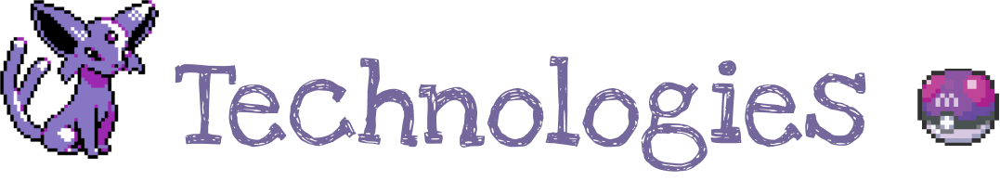
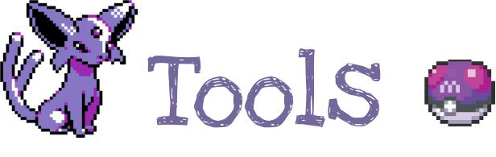

    <a>
        
      
    

<!--Contatos -->

  

    <h4 style="color:gray; font-family: 'Cursive';"> Desenvolvedora e triste. </h4>

---

<!-- Tecnologias -->

    <b>

    
    

---

<!-- Ferramentas -->

    <b>

  

  

